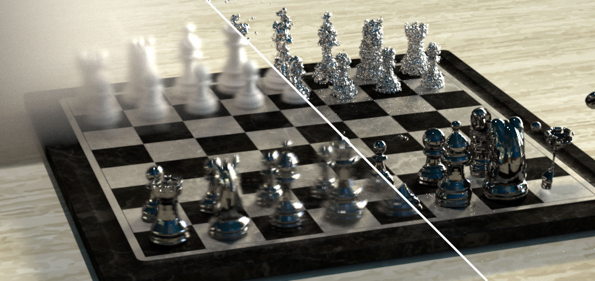

# Sparse Convolution GPIS (C++ Code)

### [Project Page](https://cs.dartmouth.edu/~wjarosz/publications/xu25practical.html) | [Paper](https://cs.dartmouth.edu/~wjarosz/publications/xu25practical.pdf) | [Shadertoy Code](https://github.com/dartmouth-vcl/sparse-conv-gpis-shadertoy)



This repository contains the source code for the SIGGRAPH Asia 2025 paper:

> **Practical Gaussian Process Implicit Surfaces with Sparse Convolutions**<br>
> Kehan Xu (Dartmouth College), Benedikt Bitterli (NVIDIA), Eugene d'Eon (NVIDIA), Wojciech Jarosz (Dartmouth College)

The implementation is built upon the CPU-based [Tungsten renderer](https://github.com/tunabrain/tungsten) and extends the [codebase](https://github.com/daseyb/gpis-light-transport) from the paper ["From microfacets to participating media: A unified theory of light transport with stochastic geometry"](https://cs.dartmouth.edu/~wjarosz/publications/seyb24from.html). For general usage and setup instructions, please refer to Tungsten’s official documentation.

# Overview

Different Gaussian process implicit surface (GPIS) representations are implemented as new medium types in `src/core/media/SparseConvolutionNoiseMedium/`. This includes the function space (`FunctionSpaceGaussianProcessMedium`) and weight space (`WeightSpaceGaussianProcessMedium`) representations from prior work, as well as our new method that approximates GPISes as procedural noise (`SparseConvolutionNoiseMedium`).

For core volumetric functionalities, `sampleDistance` computes the closest intersection with a randomly sampled GPIS realization, while `transmittance` returns `0` or `1` depending on whether the ray intersects a random realization.

All GPIS representations are rendered using Tungsten’s standard path tracer located at `src/core/integrators/path_tracer/PathTracer.cpp`.

The core logic of sparse convolution noise is implemented in `src/core/math/sparseConvolutionNoise.cpp`, which includes:
- Evaluation of values and gradients for both 3D and 1D noise.
- Conditioning for the Renewal and Renewal+ memory models.
- Next-event estimation for GPISes with mirror or conductor materials (supported for 1D noise).
- Multi-resolution sparse convolution noise.

Finally, `src/core/math/GPFunctions.cpp` contains the implementation of various stationary and non-stationary convolution kernels and their corresponding covariance functions.

# Scene Files

We provide the JSON scene files on [Google Drive](https://drive.google.com/file/d/1nzmRUxxPsP5bIgX6SrOjjc0_664KtQgQ/view?usp=sharing) that reproduce the results presented in the paper. Some scene files include multiple rendering configurations, where only one is active while the others are commented out and annotated for clarity.

Additionally, the rendered results are available through an interactive viewer on the project webpage.

## Parameters
Here we list the key parameters for our sparse convolution noise implementation, as well as those for other methods used for comparison.

### Shared Parameters
- **step\_size**: `float`; fixed step size for ray marching.
- **correlation\_context**: `string`, "none", "renewal", "renewal+", or "global"; specifies the memory model.
- **single\_realization**: `bool`; whether to render a single realization (not applicable in function space) or the ensemble average of a GPIS.
- **seed**: `int`; random seed for the GPIS; changing it produces a different single realization.

### Sparse Convolution Noise
- **impulse\_density**: `float`; controls the density (number) of convolution kernels placed per cell.
- **1D\_sampling**: `bool`; chooses between 1D or 3D sparse convolution noise sampling.
- **isotropic\_3D\_sampling**: `bool`; when using 3D sampling, determines whether sampling in world space or isotropic space.
- **1D\_sampling\_scheme**: `string`, "uni", "nee", or "mis"; specifies the importance sampling scheme when next-event estimation is enabled.
- **1D\_gradient\_correlationXY**: `bool`; selects between Renewal+ (`true`) and Renewal Half+ (`false`) memory models for next-event estimation.

### Weight Space
- **basis\_functions**: `int`; number of random Fourier features used.

### Function Space
- **sample\_points**: `int`; number of points sampled along the ray per batch, conditioned on the previous batch.

# Citation

If you find this code useful in your academic research, please cite the original paper:
```
@article{xu25practical,
    author  = {Xu, Kehan and Bitterli, Benedikt and d'Eon, Eugene and Jarosz, Wojciech},
    title   = {Practical {G}aussian Process Implicit Surfaces with Sparse Convolutions},
    journal = {ACM Transactions on Graphics (Proceedings of SIGGRAPH Asia)},
    year    = {2025},
    month   = dec,
    volume  = {44},
    number  = {6},
    doi     = {10.1145/3763329}
}